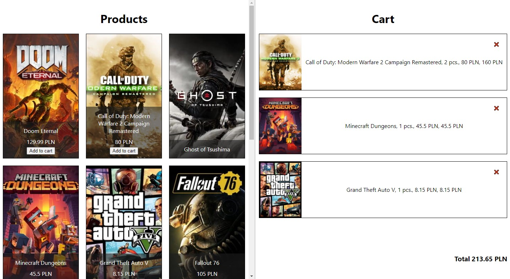

# A simple & responsive React shopping cart mock.

[See the demo!](http://kartm.github.io/sample-react-shopping-cart)

## Running the project locally

1. `npm install` in the root directory
2. `npm start`

## Technological stack used:
- React
- Redux
- SCSS

## Screenshots

